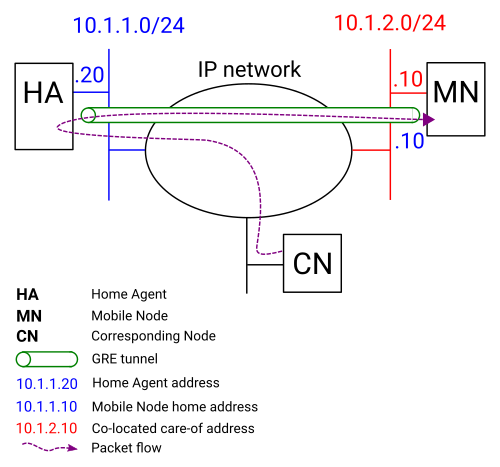

# Mobility Management Simulator

> aka. MM-Sim

- Mobility Management
- Mobile IP: MIPv4 and MIPv6

Partial implementation of [RFC 5944](https://tools.ietf.org/html/rfc5944) Mobile IP framework for Linux Ubuntu 22.04LTS, written in Python 3.10.

---

:fire: *News* :fire:

- [2025-0309] MM-Sim is supporting Ubuntu 22.04 LTS and Python 3.10

## Overview

Mobile IP (MIP) framework allows transparent routing of IP packets to mobile nodes regardless of its current point of attachment in a the Internet. Thanks to MIP, mobile node is able to roam from an its home network to any foreign network, being always reachable through its home IP address.

Following key features are supported:

* Mobile IP protocol (Registration Request and Reply)
* Mobile-Home Authentication Extension (MHAE) with  the 128-bit key `HMAC-MD5` authentication algorithm
* Home Agent entity
* Mobile Node entity
* Co-located CoA mode
* Forward and Reverse tunneling
* GRE encapsulation
* Identification based on timestamp

Following key features are not supported:

* Agent discovery and advertisement with ICMP
* Foreign Agent entity
* Minimal encapsulation
* Broadcast datagrams

Basic use case that can be achieved with this implementation of MIP is shown on figure below.



## Quick Start

**Create a venv**

```sh
# create a venv with py3.10
python -m venv .venv
# activate
source .venv/bin/activate
```

**Dependencies**

```bash
# plz make sure you are under a python venv
pip install ntplib pyroute2 netaddr
```

**Run**

```bash
cd mobility-management-linux
# HOME AGENT: with sudo privilege!!!
sudo $(which python3) -m examples.home_agent examples/ha.cfg
# MOBILE NODE: with sudo privilege!!!
# start
sudo $(which python3) -m examples.mn_agent start examples/mn.cfg
# Other args like: stop / register / deregister ...
```

Then you can find:

```bash
(.venv) huluobo@ubuntu-22:/Users/huluobo/Github_Content/MobileIP$ sudo $(which python3) -m examples.home_agent examples/ha.cfg
(DEBUG:<module>:172) Exiting...
/usr/lib/python3.10/runpy.py:126: RuntimeWarning: 'examples.home_agent' found in sys.modules after import of package 'examples', but prior to execution of 'examples.home_agent'; this may result in unpredictable behaviour
warn(RuntimeWarning(msg))
(INFO:start_home_agent:37) Starting Home Agent.
(DEBUG:start_home_agent:51) HA address: 127.0.0.1
(DEBUG:start_home_agent:52) HA authentications: {256: '1234567812345678'}
(DEBUG:set_proxy_arp:359) Proxy ARP for eth0 interface has been enabled.
(DEBUG:set_ip_forward:331) IP forward has been enabled.
(INFO:start:1828) Home Agent is started.
```

Congratulates! 👍

## Usage

MIP implementation is in the single `mip.py` module. See [API documentation](https://github.com/mkiol/MobileIP/blob/master/doc/mip.html) and the examples below to learn how to create and start HA and MN agent.

### Home Agent

Example below starts HA service on `127.0.0.1` address and `434` UDP port. HA will accept Registration Requests with authorization `SPI=256 (0x100)` and `KEY="1234567812345678"`.

```python
import mip

ha = mip.HomeAgent(
      address="127.0.0.1",
      port=434,
      auth_table={256: "1234567812345678"}
    )

ha.start()

# App loop
while True:
    pass
```

### Mobile Node

Example below starts MN agent with `127.0.0.10` as a home address. MN will make use of `eth0` (default gateway is `10.1.2.5`) and `wlan0` (default gateway is `10.1.3.5`) network interfaces. MN will register its home address using `eth0` interface with lifetime 1000 seconds.

```python
import mip
import logging

mn_agent = mip.MobileNodeAgent(
            mhae_spi=256,
            mhae_key="1234567812345678",
            home_agent="127.0.0.1",
            home_address="127.0.0.10",
            interfaces={"eth0": "10.1.2.5", "wlan0": "10.1.3.5"}
        )

mn_agent.register(
        ifname="eth0", 
        lifetime=1000,
        exception_handler=exception_handler
    )

# App loop
while True:
    pass
```

## Related Work

This repo is inspired by [mkiol's Mobile IP](https://github.com/mkiol/MobileIP) 🫡

This project, developed by [Boxuan Hu](https://bxhu2004.com/), rectifies errors in previous work and upgrades the entire project from Python 2 to Python 3, incorporating a comprehensive restructuring. 🚀

Modifications and additions are licensed under [MIT-License](https://en.wikipedia.org/wiki/MIT_License). For details on what changes were made, please refer to the commit history.

The project is currently stable on Linux Ubuntu 22.04 LTS and supports Python 3.10. 🌟

