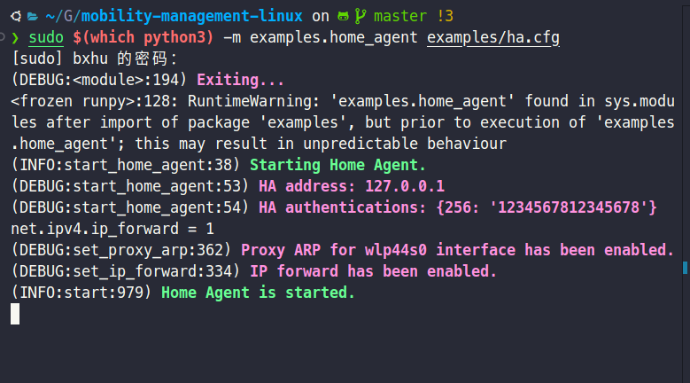
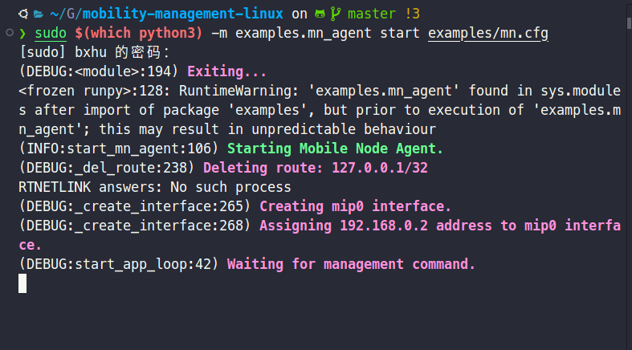
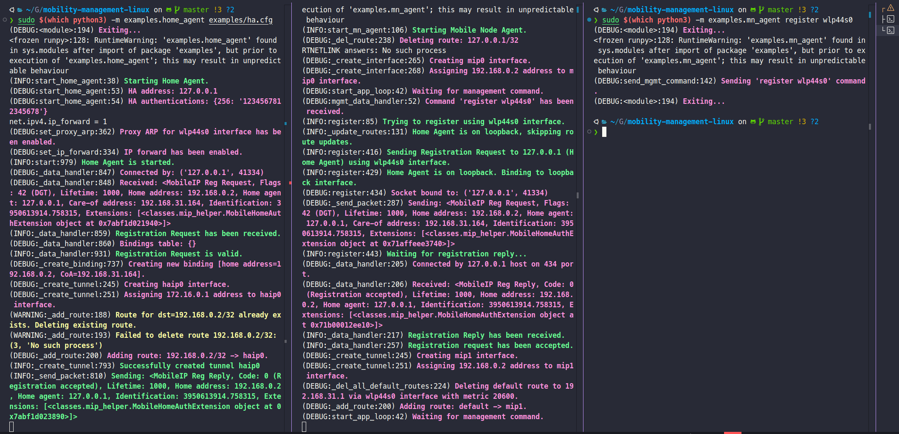
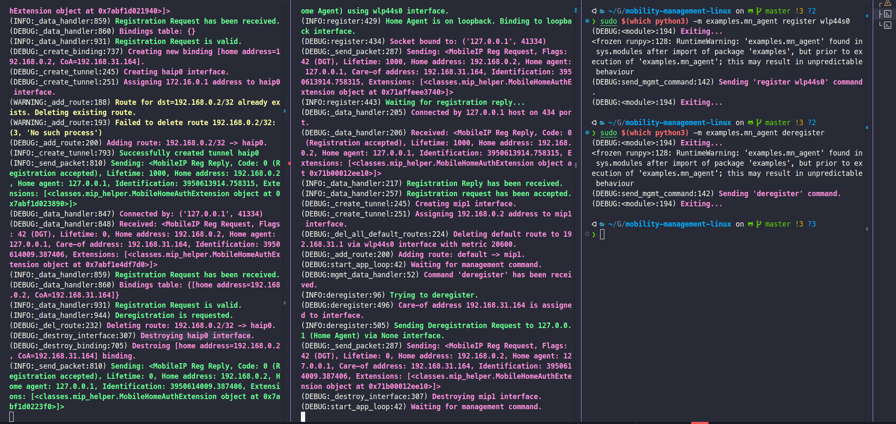
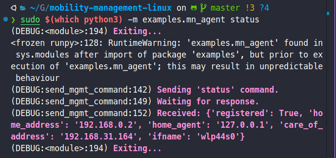
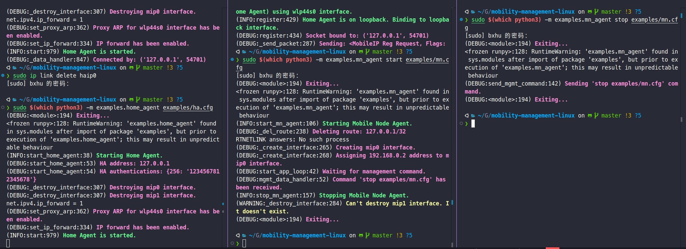

# Instance Usage

> Make sure you are under $mobility-management-linux when using these commands

```bash
# make sure
cd $mobility-management-linux
# activate .venv
source .venv/bin/activate
```

## Home Agent

* `home_agent.py` - HA implementation
* `ha.cfg` - HA configuration

Currently HA only has a `start` service.

### start HA service

```bash
# clear ha interfaces at first
sudo ip link delete haip0
# start ha service
sudo $(which python3) -m examples.home_agent examples/ha.cfg
```

### stop HA service

Just use `ctrl+c` in corresponding CLI window :))



## Mobile Node

* `mn_agent.py` - MN implementation
* `mn.cfg` - MN configuration

Compared to the single `start` function of HA, you can perform various operations on MN:

- `start`: start MN service
- `register`: send a register request from MN to HA
- `deregister`: send a register revocation from MN to HA
- `status`: show current connecting status
- `stop`: turn off MN service

It is strongly recommended that you conduct all experiments in the specified order according to cmds mentioned above.

### start MN service

```bash
sudo $(which python3) -m examples.mn_agent start examples/mn.cfg
```



### register with specific interface

**Get your own networked interface:**

```bash
# install net-tool pkts
sudo apt update
sudo apt install net-tools
# use `ifconfig` to get corresponding interface
ifconfig
```

For instance, on bxhu's local machine:

```bash
❯ ifconfig
Meta: flags=4305<UP,POINTOPOINT,RUNNING,NOARP,MULTICAST>  mtu 9000
        inet 172.29.0.1  netmask 255.255.255.252  destination 172.29.0.1
        inet6 fe80::b28:ed35:ecef:a0b4  prefixlen 64  scopeid 0x20<link>
        unspec 00-00-00-00-00-00-00-00-00-00-00-00-00-00-00-00  txqueuelen 500  (未指定)
        RX packets 650319  bytes 245351658 (245.3 MB)
        RX errors 0  dropped 0  overruns 0  frame 0
        TX packets 650381  bytes 245140151 (245.1 MB)
        TX errors 0  dropped 0 overruns 0  carrier 0  collisions 0

enp0s31f6: flags=4099<UP,BROADCAST,MULTICAST>  mtu 1500
        ether 98:8f:e0:60:ad:19  txqueuelen 1000  (以太网)
        RX packets 0  bytes 0 (0.0 B)
        RX errors 0  dropped 0  overruns 0  frame 0
        TX packets 0  bytes 0 (0.0 B)
        TX errors 0  dropped 0 overruns 0  carrier 0  collisions 0
        device interrupt 16  memory 0x5e580000-5e5a0000  

haip0: flags=209<UP,POINTOPOINT,RUNNING,NOARP>  mtu 65511
        inet 172.16.0.1  netmask 255.255.255.255  destination 172.16.0.1
        inet6 fe80::7f00:1  prefixlen 64  scopeid 0x20<link>
        unspec 7F-00-00-01-00-00-00-00-00-00-00-00-00-00-00-00  txqueuelen 1000  (未指定)
        RX packets 18216  bytes 1108096 (1.1 MB)
        RX errors 0  dropped 0  overruns 0  frame 0
        TX packets 8  bytes 1638 (1.6 KB)
        TX errors 0  dropped 0 overruns 0  carrier 0  collisions 0

lo: flags=73<UP,LOOPBACK,RUNNING>  mtu 65536
        inet 127.0.0.1  netmask 255.0.0.0
        inet6 ::1  prefixlen 128  scopeid 0x10<host>
        loop  txqueuelen 1000  (本地环回)
        RX packets 208141  bytes 357716709 (357.7 MB)
        RX errors 0  dropped 0  overruns 0  frame 0
        TX packets 208141  bytes 357716709 (357.7 MB)
        TX errors 0  dropped 0 overruns 0  carrier 0  collisions 0

vmnet1: flags=4163<UP,BROADCAST,RUNNING,MULTICAST>  mtu 1500
        inet 172.16.122.1  netmask 255.255.255.0  broadcast 172.16.122.255
        inet6 fe80::250:56ff:fec0:1  prefixlen 64  scopeid 0x20<link>
        ether 00:50:56:c0:00:01  txqueuelen 1000  (以太网)
        RX packets 0  bytes 0 (0.0 B)
        RX errors 0  dropped 0  overruns 0  frame 0
        TX packets 1704  bytes 0 (0.0 B)
        TX errors 0  dropped 0 overruns 0  carrier 0  collisions 0

vmnet8: flags=4163<UP,BROADCAST,RUNNING,MULTICAST>  mtu 1500
        inet 172.16.162.1  netmask 255.255.255.0  broadcast 172.16.162.255
        inet6 fe80::250:56ff:fec0:8  prefixlen 64  scopeid 0x20<link>
        ether 00:50:56:c0:00:08  txqueuelen 1000  (以太网)
        RX packets 0  bytes 0 (0.0 B)
        RX errors 0  dropped 0  overruns 0  frame 0
        TX packets 1700  bytes 0 (0.0 B)
        TX errors 0  dropped 0 overruns 0  carrier 0  collisions 0

wlp44s0: flags=4163<UP,BROADCAST,RUNNING,MULTICAST>  mtu 1500
        inet 192.168.31.164  netmask 255.255.255.0  broadcast 192.168.31.255
        inet6 fe80::6798:8343:cf4b:d02  prefixlen 64  scopeid 0x20<link>
        ether e0:0a:f6:9b:0d:5b  txqueuelen 1000  (以太网)
        RX packets 759794  bytes 630973464 (630.9 MB)
        RX errors 0  dropped 0  overruns 0  frame 0
        TX packets 514337  bytes 74975406 (74.9 MB)
        TX errors 0  dropped 242 overruns 0  carrier 0  collisions 0
```

Our target address should start with `192.168`.  

Therefore, it's easy to identify *wlp44s0*, whose `inet` address is `192.168.31.164`.  

Please fill in the `interface_name` and `address` in the `.cfg` file accordingly.

**Modify your configuration file (`mn.cfg`):**

```
[MobileNodeAgent]
spi=256
key=1234567812345678
home_agent=127.0.0.1
home_address=192.168.0.2
#TODO(user): This line should be config according to your own network
if_gateways={"wlp44s0": "192.168.31.164"} # on bxhu's linux physical machine
```

Fill `interface_name` and `address` in `if_gateways={}`.

**Register with this interface**

```bash
sudo $(which python3) -m examples.mn_agent register [YOUR-INTERFACE]
```

`[YOUR-INTERFACE]` is the same as that in `.cfg` file



### deregister

```bash
sudo $(which python3) -m examples.mn_agent deregister
```



### get status info

```bash
sudo $(which python3) -m examples.mn_agent status
```



### stop MN service

```bash
sudo $(which python3) -m examples.mn_agent stop examples/mn.cfg
```



